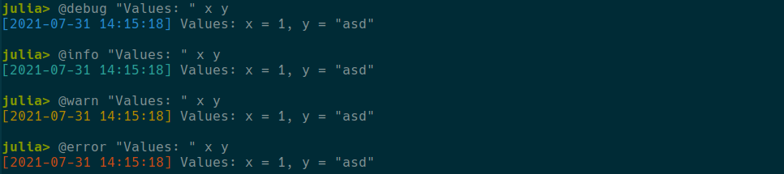
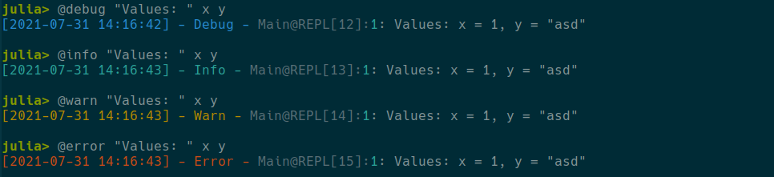
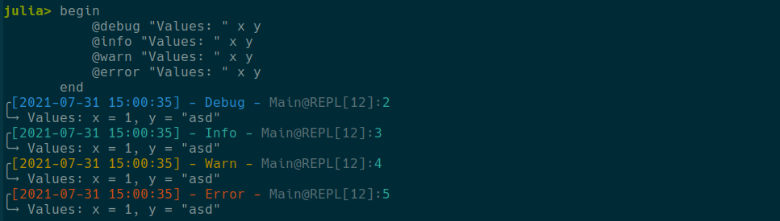
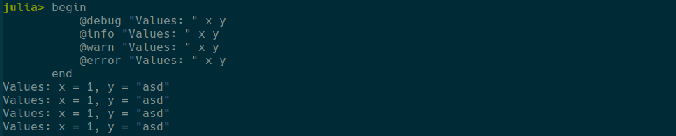
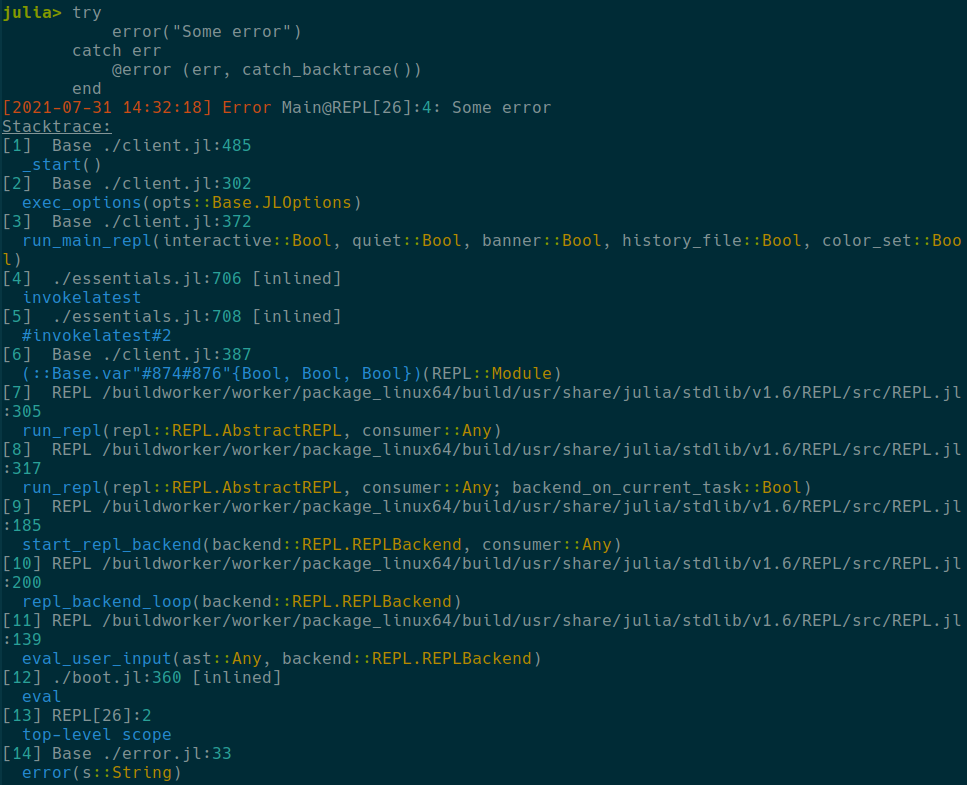

# MiniLoggers.jl

|                                                                                                    **Documentation**                                                                                                    |                                                                                                                              **Build Status**                                                                                                                              |                                                                                                              **JuliaHub**                                                                                                              |
|:-----------------------------------------------------------------------------------------------------------------------------------------------------------------------------------------------------------------------:|:--------------------------------------------------------------------------------------------------------------------------------------------------------------------------------------------------------------------------------------------------------------------------:|:--------------------------------------------------------------------------------------------------------------------------------------------------------------------------------------------------------------------------------------:|
| [](https://JuliaLogging.github.io/MiniLoggers.jl/stable)[](https://JuliaLogging.github.io/MiniLoggers.jl/dev) | [](https://github.com/JuliaLogging/MiniLoggers.jl/actions)[](https://codecov.io/gh/JuliaLogging/MiniLoggers.jl) | [](https://juliahub.com/ui/Packages/MiniLoggers/5ppWi)[](https://juliahub.com/ui/Packages/MiniLoggers/5ppWi) |

`MiniLoggers.jl` provides Julia logger with minimal setup and simple yet powerful format of logging strings. It allows to build custom and compact logging, which supports coloring, output to external files, timestamps and many more.

# Installation

`MiniLoggers.jl` is a part of General registry, so it should be installed with

```julia
julia> using Pkg; Pkg.add("MiniLoggers")
```

# Examples of usage

In it's most simple form, `MiniLoggers.jl` is used as
```julia
using MiniLoggers

MiniLogger(minlevel = MiniLogger.Debug) |> global_logger

x = 1
y = "asd"

@debug "Values: " x y
@info "Values: " x y
@warn "Values: " x y
@error "Values: " x y
```

and produces 



But one can make it more colourful and add more details with initilization like the following

```julia
MiniLogger(minlevel = MiniLoggers.Debug, 
           format = "{[{datetime}] - {level} - :func}{{module}@{basename}:{line:cyan}:light_green}: {message}") |> global_logger

@debug "Values: " x y
@info "Values: " x y
@warn "Values: " x y
@error "Values: " x y
```

which yields



Or, we can add small unicode magic and get fancy two-line logging format

```julia
MiniLogger(minlevel = MiniLoggers.Debug, 
           format = "╭{[{datetime}] - {level} - :func}{{module}@{basename}:{line:cyan}:light_green}\n╰→ {message}") |> global_logger
```



Format constructor is very flexible, so the output of log messages is mostly limited by your imagination.

At the same time, you can go other way arround and remove all extra details completely turning it effectively to a basic `println` command, thus making it convinient to plug minilogger in packages like [LoggingExtras.jl](https://github.com/JuliaLogging/LoggingExtras.jl)

```julia
MiniLogger(minlevel = MiniLoggers.Debug, format = "{message}") |> global_logger
```



Also `MiniLoggers.jl` support Julia exceptions, so you can generate error messages in a usual way

```julia
MiniLogger(minlevel = MiniLoggers.Debug, 
           format = "{[{datetime}] {level}:func} {module}@{basename}:{line:cyan}: {message}") |> global_logger

try
    error("Some error")
catch err
    @error (err, catch_backtrace())
end
```


